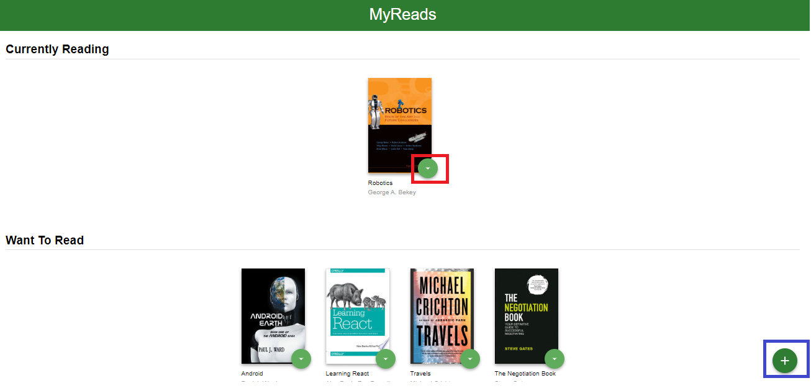
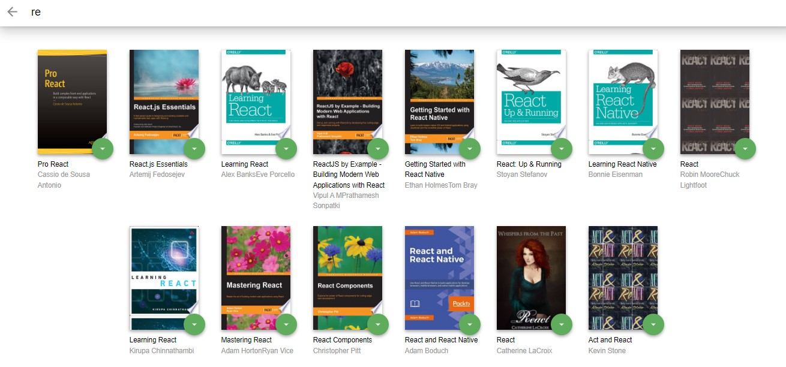

# MyReads App
This is an app for your books. You can search for books and/or add,change or remove books from these book shelves.
There are two pages : Main page and search page. In the main page, you can find three different shelves:
 * Currenlty reading  
 * Want To Read 
 * Read

 ----------------------

 ## Main Page 

 - You can simply change the shelf of a book that it is in by clicking the down-arrow button or remove the book from any of the shelves by clicking "None".  
 
 
 The screenshot above depicts the main page, where red square is the menu for changing/removing book from a shelf, the blue square is for navigating to the search page. 

## Search Page
- You can search for books (please note that the search is limited by some keywords) and add/change the book to any shelf that is on the main page.



  -------------------------
<br>

### How to install and launch the project 
To install the project 

``` 
git clone https://github.com/merv-e/nd0191-c1-myreads.git
cd nd0191-c1-myreads    
npm install 
```
  ----------------------
<br>

To launch the project 
``` 
npm start
```

 This is the first project in Udacity's Senior Front End Engineer - OLX Scholarship Course.

